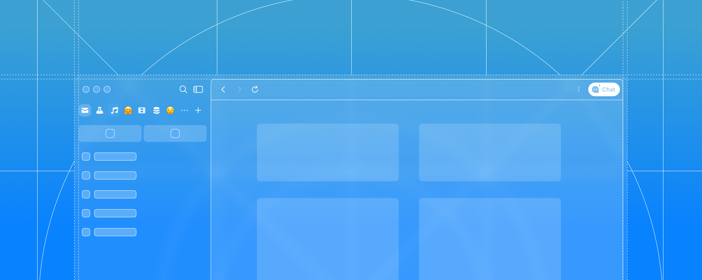

# Phi Browser

**The AI browser for macOS.** Agentic, local-first, native Swift.

Phi is a Chromium-based browser built as a real native macOS app (AppKit + SwiftUI), with an AI agent that acts in the page, a memory that lives in a file you can read, and the option to run AI entirely on your own machine. It is built for something new: a browser a person and an AI agent can use *together*, in the same window and the same session, each a first-class user.

**Download Phi** (free, Apple Silicon): **[phibrowser.com](https://phibrowser.com)**
If this is your kind of thing, a ⭐ helps a lot.

 

## What makes it different

- **Built for people who live in a browser.** Phi is an everyday browser made for heavy, all-day use, with the productivity power-ups that implies. It is also built so an AI agent can work beside you: seeing what you are working on, carrying the thread forward, and handing it back, in the same window and the same session rather than boxed off in a sandbox.
- **Simple until you want more.** Phi opens as a clean tabbed browser that feels properly at home on macOS, and nothing is in your way until you reach for it. Then it unfolds: spaces, profiles, split views, tab groups, URL rules, keyboard shortcuts, Raycast support, picture-in-picture, and plenty more.
- **The AI goes as deep as you want it to.** Persistent memory that builds up as you work. An assistant you can shape to how you think. Scheduled tasks that run without you. Private AI, where models run on your own Mac and nothing leaves it. A local guardrail that screens credentials out before anything reaches memory. Phi Sentinel, a separate daemon that oversees the AI work rather than burying it in the browser process. Your memory exposed over MCP. A command-line interface. And the ability to hand Phi to another agent entirely and let it drive.
- **An agent with the same reach you have.** The agent sees what you see and picks up from where you are, so you rarely have to spell out every step. Inside a browser window today most things are full applications rather than pages, and the agent operates them the way you would, with the same capabilities as a human operator and a visible record of every action it took. Not a chat panel bolted onto a browser.
- **Memory you can actually read.** Phi's memory of your browsing is created and stored on your device and stays your property. You can open it, edit it, delete entries, or wipe it. We do not collect it and we do not upload it. We do not train AI models on your content.
- **Your AI, your choice of where it runs.** Point Phi at models on your own Mac or your own hardware through LM Studio or Ollama, and no account is involved. Or use Phi Cloud. Or switch AI off entirely and use Phi as a plain browser.
- **Skills it builds for itself.** Show the agent a workflow once and it condenses what you did into a reusable skill, ready the next time you need it.
- **Independent, and nothing to lock you into.** Phinomenon is a small independent software house. We do not run a search business, an ad network, or a cloud we need to keep you inside, so our incentive is simply that you like the browser enough to keep it. Bring your own models, use ours, or use none.
- **A real browser underneath.** A genuine Chromium engine with a native macOS client on top, AppKit and SwiftUI. A full browser that holds up as one, fast and at home on the Mac.

 

## What this repository is

This is the source of the Phi Browser macOS client, published under Apache 2.0. It is not a mirror or a snapshot: the Phi you download from phibrowser.com is built from this repository, from these commits. A fix that lands here lands in the browser people are actually using.

We publish it for a fairly simple reason. A browser sees everything you do, and we would rather you could read the code that runs it than take our word for how it behaves. Developing in the open tends to produce better software too: bugs get found that we would have missed, and people who care about one detail more than we ever could come and fix it properly.

Not all of Phi is here, and we would rather point at the line than let you discover it. The browser engine is our own Chromium build. We release it as a built binary you can download and link against, and you need it to build this repository, but its source is not published. The server side stays with us as well: the models, the prompts, and the pipelines behind the AI features. Phinomenon Inc. is a company rather than a foundation, and that shapes where the boundary sits. Section 1 of our [Terms of Use](https://phibrowser.com/terms/) sets out the same boundary in legal language.

### A build you make yourself

The Apache licence gives you the right to build this source, change it, and ship it. A build you make is your own browser. It is not the Phi we distribute, and the two are not interchangeable.

A self-built Phi does not sign in to a Phi account, does not reach Phi Cloud, does not sync, and does not use our connectors or messaging relay. It does not receive our updates: the updater is part of what we ship, not part of what we publish. It carries your signature or none.

Our [Terms of Use](https://phibrowser.com/terms/) and [Privacy Statement](https://phibrowser.com/privacy/) cover the application we distribute from phibrowser.com. They do not cover a build you made.

Do not present a build of your own as the application we distribute.

 

## Build from source

### Requirements
- Mac with Apple Silicon
- Xcode 26+
- `Phi Framework.framework` (built binary, see above)

### Steps
1. Check out this repository.
2. Download the latest `Phi Framework` from [phibrowser/phibrowser-framework](https://github.com/phibrowser/phibrowser-framework/releases).
3. Place `Phi Framework.framework` into the root `Frameworks/` directory.
4. Open `Phi.xcodeproj` in Xcode and let Swift Package Manager resolve dependencies.
5. Select the `PhiBrowser-OpenSource` scheme.
6. Build.

 

## Contributing

Because the Phi we distribute is built from this repository, a contribution accepted here reaches everyone using Phi. You are not patching a side project or a public mirror; you are changing the browser that ships.

Contributions are welcome: bug reports, feature requests, documentation, and pull requests. Found a bug or have an idea? Open an issue first. To contribute code, send a PR with a clear description of the change and the motivation behind it.

### Getting in touch

- **Discord** for community chat, and for talking to the people who build Phi in something close to real time: [discord.com/invite/aj7rumAMgC](https://discord.com/invite/aj7rumAMgC)
- **X** for development news as it happens: [@phibrowser](https://x.com/phibrowser)
- **Security issues: please tell us privately first, at [hi@phi.cc](mailto:hi@phi.cc).** Not in an issue, not in a PR, not on Discord. Give us the chance to fix it before it is public.

### Translations

Phi ships in 8 languages, currently machine-seeded and waiting for native speakers to make them feel right. If you can read a JSON file, you can help: every user-visible string in the Phi product family lives in [phibrowser/phi-i18n](https://github.com/phibrowser/phi-i18n), each with context on where it appears and what it does. Translations merged there flow into the next Phi build automatically, credited to you. Prefer a web UI over git? Our Weblate is live at [i18n.phibrowser.com](https://i18n.phibrowser.com): browse every string without an account, sign in to translate, with a shared glossary and context for each one.

 

## License

Apache License 2.0. See [LICENSE](LICENSE). The bundled `Phi Framework.framework` is not covered by that licence; it is our proprietary build, redistributed to you as a binary. Third-party components are listed in the credits page reachable from **About Phi**, and the Chromium engine's own components at `chrome://credits`.
